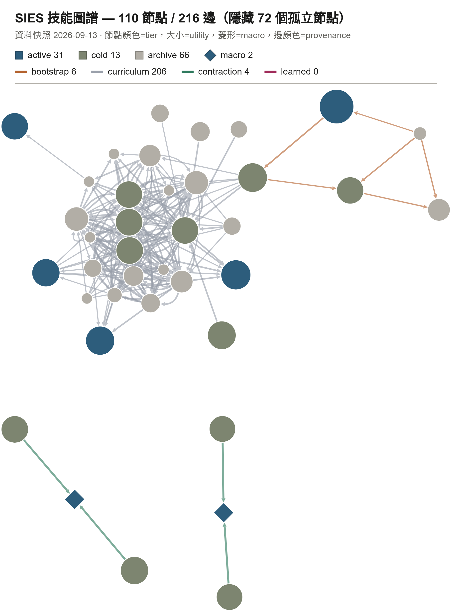
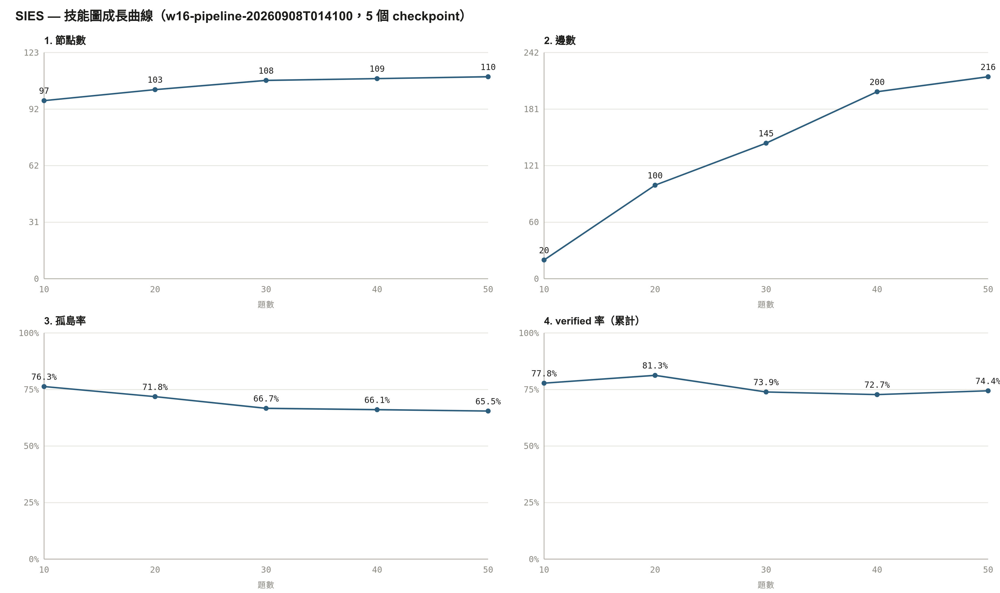
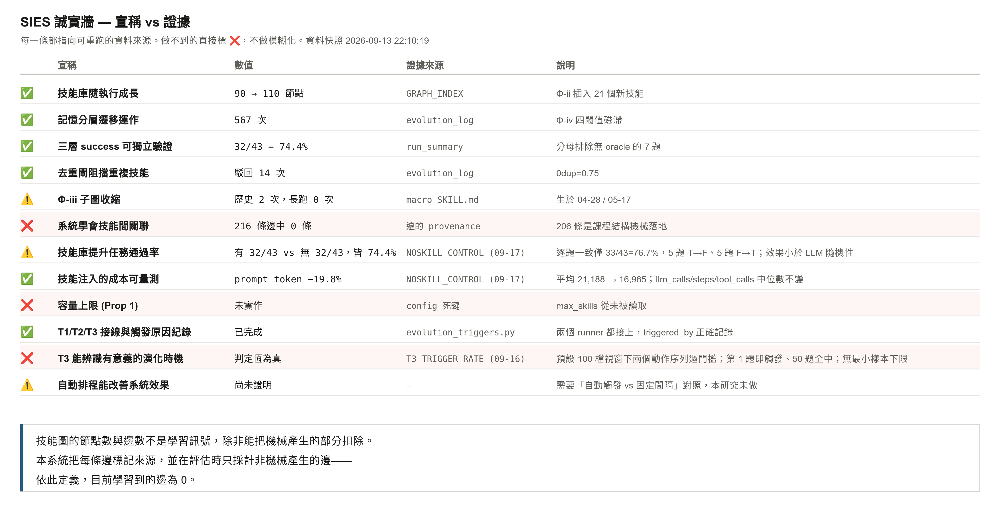
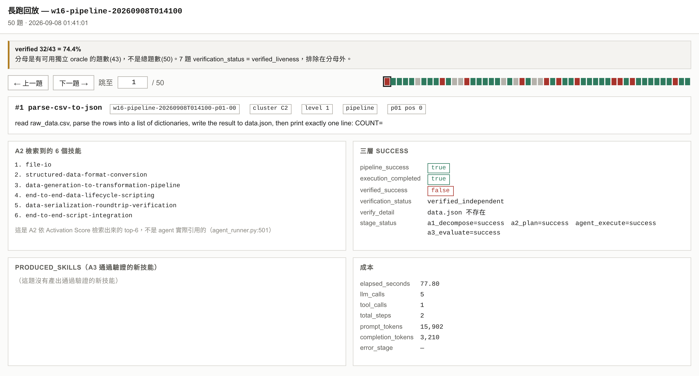

# SIES — Self-Iterative Evolutionary System

SIES 讓 LLM 代理在**模型權重全程凍結**的前提下成長：成長不發生在參數裡，而發生在一張
外顯、可讀、可回溯的**技能圖譜**上。代理每做完一批任務就回頭讀自己的執行軌跡，把可重用
的做法抽成 `SKILL.md` 存進圖；演化算子 Φ 週期性地更新技能效用、擋掉重複、把常一起用的
收縮成複合技能、再依效用把技能分到活躍／冷卻／封存三層 —— 下一次規劃只載入活躍層。
整個演化歷程是一堆人看得懂的 Markdown 與一份 `GRAPH_INDEX.md`，不是一坨權重。

## 三個數字

| | |
|---|---|
| **110** | 技能圖節點數（50 題長跑後；起始 97） |
| **216** | 技能圖邊數 —— **但請先讀下面那段誠實聲明** |
| **32/43 = 74.4%** | 獨立 oracle 驗證的任務通過率（分母排除 7 題無可用 oracle 者） |

## 誠實聲明

> 圖上 216 條邊中，206 條是課程結構機械落地、4 條是 Φ-iii 收縮的工程
> 不變式、6 條是手寫種子；由系統從統計學到的是 0 條。本專案把每條邊
> 標記來源，評估時只採計非機械產生的邊。另以同一批 50 題做過停用技能庫
> 的對照，兩組通過率同為 32/43，但逐題僅 33/43 一致 —— 效果小於語言
> 模型本身的隨機性。

完整的 12 項宣稱對照見下方圖 3，或直接開 demo 的「誠實牆」分頁。
上面這段的每個數字都可以在本 repo 裡直接重算 —— `python scripts/sies_doctor.py`
的 §2「圖結構」與 §7「紅旗」只讀 `skills/GRAPH_INDEX.md`，不需要任何執行期資料。

---

## 四張圖

**圖 1.** SIES 技能圖譜，110 個節點、216 條邊（隱藏 72 個孤立節點，佔 65.5%）。
節點顏色為記憶分層，大小為效用值，菱形為 Φ-iii 收縮產生的複合技能。
邊依來源著色：其中 206 條由課程結構機械產生，4 條為收縮的工程不變式，
6 條為手寫種子，由系統從統計學到的為 0 條。



**圖 2.** 50 題長跑的成長曲線，每 10 題取一個檢查點。右上「邊數」自 20 增至 216，
但該成長幾乎全部來自課程路徑的機械落地（206 條），不代表系統學到了技能間
的關聯；左上「節點數」97→110 才是 Φ-ii 實際插入新技能的結果。孤島率由
76.3% 降至 65.5%，同樣來自課程結構而非學習。



**圖 3.** 誠實牆：12 項宣稱與各自的證據來源。六項成立、三項部分成立、三項未達成。
每一格都指向可用 `python scripts/sies_doctor.py` 重算的資料檔。



**圖 4.** 長跑第 1 題的三層驗證。管線完成（pipeline_success=true）、代理自認已完成
（execution_completed=true），但獨立 oracle 檢查輸出檔案時發現 data.json 不存在
（verified_success=false）。這正是三層 success schema 存在的理由：代理的自我
報告不可作為成功的依據。



四張圖由 `python demo/export_figures.py`（headless chromium）從 `demo/index.html`
產生，數字全部來自 `demo/data.json`。產生方式與可重現性見
[`docs/figures/README.md`](docs/figures/README.md)。

---

## demo 怎麼看

**用瀏覽器直接開 [`demo/index.html`](demo/index.html) 就好。**
`file://` 即可，不需要起 server、不需要網路、不需要裝任何東西。
所有資料都內嵌在那個 HTML 裡，唯一的外部檔案是相對路徑的 `demo/vendor/cytoscape.min.js`。

七個分頁：

| # | 分頁 | 內容 |
|---|---|---|
| 1 | 技能圖 | 力導向圖，可點節點看該技能的 `SKILL.md` 全文；圖例可點擊只留某一類邊 |
| 2 | 語意檢索 | 8 組查詢的 A2 活化分數拆解（λ₁·sim / λ₂·U / λ₃·centrality 三段堆疊） |
| 3 | 去重閘 | 4 組候選過 `θ_dup = 0.75` 的結果 |
| 4 | 長跑回放 | 50 題逐題翻頁：題目、檢索到的技能、三層 success、產出技能、成本 |
| 5 | 成長曲線 | 5 個 checkpoint 的節點數／邊數／孤島率／verified 率 |
| 6 | 演化日誌 | Φ 的 19 次呼叫明細 |
| 7 | **誠實牆** | 12 條宣稱對照證據 |

第 2、3 頁是預先算好的快照（頁面上有標註）—— 嵌入模型冷啟動約 7.5 秒、
常駐約 14 GiB RAM，不適合在 demo 當下載入。

---

## 硬體需求與怎麼跑

產出上述資料的機器：**i9-13900K + RTX 4060 Ti 16 GB + 64 GB RAM**。
全程本地推論，沒有任何雲端 API 呼叫。

| 元件 | 設定 | 資源 |
|---|---|---|
| LLM | `Gemma-4-26B-A4B IQ4_XS`，OpenAI/Anthropic 相容端點 `localhost:8080` | GPU ~9.5 GB |
| 嵌入 | `nvidia/llama-embed-nemotron-8b`，dim 4096 | **CPU**，常駐 ~14 GiB RAM，冷啟動 ~7.5 s |
| 向量庫 | LanceDB，110 列 | 本機檔案 |
| 沙盒 | Docker `frdel/agent-zero:latest` | 容器 `sies-agent-zero` |

只想看結果的話這些都不需要 —— 開 `demo/index.html` 就夠了。

### 安裝

```bash
pip install -r requirements.txt          # 含 sentence-transformers → 會拉 torch（~2.5 GB）
export SIES_LLM_API_KEY='not-needed'     # 見 config.yaml 檔頭的憑證說明
```

`config.yaml` **不含任何金鑰**：`llm` / `llm_tier_b` 用 `api_key_env` 指向環境變數，
讀不到就直接拋 `ProviderError`，不會靜默退回明文欄位
（[`agents/provider_support.py:64`](agents/provider_support.py#L64)）。
本機端點若不驗證金鑰，填任意非空字串即可。

### 跑

```bash
python scripts/sies_doctor.py            # 一致性 / 圖結構 / 紅旗
python scripts/w16_run.py --help         # 長跑管線（需要 LLM 端點 + Docker 沙盒）
python demo/build_html.py                # 重生 demo/index.html（⚠️ 見下）
python demo/export_figures.py            # 重生 docs/figures/ 四張圖（需 playwright + chromium）
```

`sies_doctor.py` 有 7 節。**§2 圖結構**與 **§7 紅旗**（含「0 條學習來的邊」）
只讀 `skills/GRAPH_INDEX.md`，在這個 repo 裡直接就能跑。其餘幾節要讀執行期資料
（LanceDB、`memory/episodic/run_summary.jsonl`、`data/curriculum_state.json`），
本 repo 沒有這些檔案，會印 `unavailable` / `不存在` —— 這是預期的，不是壞掉。
`demo/build_data.py` 同理，要有執行期資料才跑得動；`demo/data.json` 已經是產物，
直接用即可。

⚠️ **`build_html.py` 在這個 repo 上會產出比較小的 `index.html`**：它除了
`data.json` / `queries.json`，還會去讀 `data/w16/runs/<run_id>/tasks.jsonl`
取 50 題的題目描述（`attempts.jsonl` 只有 `task_id`，沒有題目文字），而那是
執行期產物、不隨 repo 發布。缺了它會印 `[warn]`，長跑回放分頁就只剩
「（tasks.jsonl 無此題描述）」。**版控裡的 `demo/index.html` 是題目描述齊全的
完整版，不要用這個 repo 重跑覆蓋掉它。**

### 測試

```bash
SIES_LLM_API_KEY=not-needed pytest      # → 115 passed, 1 deselected
```

`conftest.py` 有一份 **`SAFE_TESTS` 白名單**：只收集經過隔離改寫、保證不碰真實資料
的測試檔，其餘歷史整合測試一律不收集（跑完會列出被排除的清單）。本 repo 收集
8 個檔、116 個測試，乾淨 clone 上 **115 passed、0 failed**。

兩個已知狀況：

- **`SIES_LLM_API_KEY` 一定要設**，沒設的話 2 個測試會以
  `ProviderError: Required credential environment variable is not set` 失敗。
  這是 `api_key_env` 的預期行為，不是 bug。
- 那 1 個 deselected 是
  `tests/test_p1_signals.py::TestProfilerTagDriven::test_write_false_does_not_touch_disk`，
  由 `pytest.ini` 的 `addopts` 排除。它比對 `data/ability_profile_live.json` 的
  mtime 來證明 `write=False` 不寫磁碟，而那是長跑的執行期產物、不進版控。
  要跑它就先跑一次長跑把檔案生出來，再直接指定該 nodeid。

---

## 檔案地圖

```
README.md                    ← 本檔
ARCHITECTURE.md              ← 架構速覽：閉環、四個演化算子、形式化物件 → 實作落點、已知偏離
config.yaml                  ← 全系統設定（含哪些鍵是死鍵的誠實標註）
requirements.txt

agents/                      ← A1 分解、A2 規劃前端、執行器、A3 萃取、課程出題
  task_decomposer.py           A1：自然語言任務 → T_struct
  simple_agent.py              最小化 ReAct 代理（工具＝程式碼／shell／網路搜尋）
  agent_runner.py              單題管線：A1 → A2 → 執行 → A3
  skill_extractor.py           A3：從軌跡抽候選技能
  skill_validator.py           Φ-ii 三重驗證，含 θ_dup = 0.75 去重閘
  curriculum_agent.py          依能力側寫出題；curriculum_loop.py 是自動閉環
  llm_client.py                多供應商（anthropic / openai / google）
  provider_support.py          憑證、端點、請求預算

evolution/                   ← 演化算子 Φ
  evolution_operator.py        Φ 主體：依序跑 Φ-i → Φ-ii → Φ-iii → Φ-iv
  utility_engine.py            Φ-i：U(σ) = α·r + β·f − γ_c·c 與時間衰減
  graph_contractor.py          Φ-iii：共現雙門檻 → macro 節點
  memory_tier_manager.py       Φ-iv：遲滯閾值的三層遷移
  provenance_edges.py          **每條邊的來源標記** —— 誠實聲明就是靠它算出來的
  evolution_triggers.py        T1 / T2 / T3

memory_planner.py            ← A2：活化分數 Act(σ) = λ₁·sim + λ₂·U + λ₃·centrality
embedding_engine.py          ← 嵌入（本機 sentence-transformers 或遠端 API）
vector_store.py              ← LanceDB 封裝
executor.py                  ← 執行器對外介面
parse_graph_index.py         ← GRAPH_INDEX.md ⇄ networkx 圖
skill_md_sections.py         ← SKILL.md 區段解析
embedding_profile.py         ← 嵌入模型設定

skills/                      ← 技能圖本體，110 個 SKILL.md
  GRAPH_INDEX.md               圖的唯一真相來源（節點、邊、來源標記）
  active/ (31，其中 5 個在 active/seed/)  cold/ (13)  archive/ (66)

demo/                        ← 離線單檔前端（見上方「demo 怎麼看」）
  index.html                   產出物，直接開這個
  template.html                版面 + CSS + JS（資料是 placeholder）
  build_data.py / build_queries.py / build_html.py
  export_figures.py            headless chromium → docs/figures/
  data.json / queries.json     內嵌進 index.html 的資料
  vendor/cytoscape.min.js      唯一的第三方前端相依（MIT）

scripts/
  sies_doctor.py               一致性與誠實牆重算
  w16_run.py / w16_preflight.py  長跑管線
  verify_runner.py             獨立 oracle 驗證
  analyze_cooccurrence.py      共現統計（Φ-iii 的輸入）

docs/
  figures/                     四張圖 + 圖說 + 產生方式
  paper/main.pdf               論文
  a1_api.md / a2_api.md / a3_api.md   三個 agent 的介面契約

tests/  conftest.py  pytest.ini   ← SAFE_TESTS 白名單，見上方「測試」
data/_pytest_tmp/                 ← 空目錄；pytest 的 basetemp 只允許開在這底下
```

**沒有進這個 repo 的東西**：執行期資料（`data/`、`memory/episodic/`、LanceDB 檔案）、
記憶層原型（`memory_catalog.py` 等，`agents/simple_agent.py:242` 只在
`memory_links.enabled` 為真時才 import，本 repo 的 `config.yaml` 沒有這個區塊，
預設為假）、內部進度與稽核文件、論文原始碼。

---

## 論文

- **[`docs/paper/main.pdf`](docs/paper/main.pdf)** —— 形式化定義、四個演化算子、評估設計。
- [`ARCHITECTURE.md`](ARCHITECTURE.md) 的「形式化物件 → 實作落點」對照表把論文裡的每個
  Definition / Equation 指到實際的檔案與行號，也列出實作**刻意偏離**論文的地方
  （例如 Φ-iii 不移除 parent 節點）。
